

# Energy Informatics 1

The following document represents a summary of the lecture _Energy Informatics 1_ by Professor Dr. Veit Hanenmeyer at the _Institut für Automation und angewandte Informatik (IAI)_ of KIT.

## Introduction

### Energy Trilemma

- Energy security
- Energy equity
- Environmental sustainability

### Stats

- Primary energy supply 2022 - 15,577 PJ
- Primary energy consumption 2022 - 11,750 PJ
    - 1 PJ = 10^15 J

### Energy

Energy is the ability of a physical system to perform work.

Forms of energy:
- Kinetic energy $E_{kin}$
- Potential energy $E_{pot}$
- Mechanical energy $E_{mech} = E_{kin} + E_{pot}$
- Chemical energy $E_{chem}$
- Thermal e energy $E_{th}$
- Electrical energy $E_{el}$
- etc.

### Kinetic Energy

$$
E_{kin} = \frac{1}{2}\ m\ v^2 = \frac{1}{2}\ J\  \omega^2
$$

where

$m$ - mass in $kg$

$v$ - velocity in $m/s$

$J$ - moment of inertia in $kg\ m^2$

$\omega$ - angular velocity in $1/s$

Equivalent unit: $1J = 1 kg\ m^2/s^2$

### Potential Energy

$$
E_{pot} = m\ g\ h_z
$$

where

$m$ - mass in $kg$

$g = 9.81\ m/ s^2$ - gravitational constant 

$h_z$ - height in $m$

### Thermal Energy

Energy that is stored in the unordered movement of atoms or molecules in matter.

$$
E_{th} =    c\ m\ T_{abs}
$$

where

$c$ - specific heat capacity in $kJ/(kg\ K)$

$m$ - mass in $kg$

$T_{abs}$ - absolute temperature in $K$

### Electrical Energy

Electricity is the set of physical phenomena associated with the presence and motion of matter that has a property of electric charge.

$$
E_{el} = U \cdot I \cdot \Delta t = U \cdot Q
$$

where

$U$ - voltage in Volt $[V]$

$I$ - current in Ampere $[A]$

$\Delta t$ - time difference in $s$

$Q$ - electric charge in colomb $[C]$ ($1C = 1\ As$)

#### Energy in the electrostatic field of a capacitor

$$
E = \frac{1}{2} \cdot C \cdot U^2
$$

where

$C$ - capacitance in farad $[F]$

#### Energy stored an inductor

$$
E = \frac{1}{2} \cdot L \cdot I^2
$$

where

$L$ - inductance in henry $[H]$

### Work

Work $[J]$ is the transfer of energy by a force acting on an object as it is displaced

$$
W = F \cdot \Delta x
$$

where

$F$ - force in newton $[N]$

$\Delta x$ - distance in $m$

### Power

Power $[W]$ is the energy $\Delta E$ transferred or converted during a time period $\Delta t$.

$$
P = \frac{\Delta E}{\Delta t} \iff \Delta E = P \cdot \Delta t
$$

It applies:

$1\ W = 1\ J/s = 1\ kg\ m^2/s^3$

### System

Object of observation

- System boundary - Separation of the system from its surroundings
- State variables - Characteristics of the system
- Intensive state variables - _Align_ with each other when merging two systems
- Extensive state variables - _Add up_ when merging two systems
- Specific state variables - State variables referring to the amount of the matter

### State

All values of state variables at a given time

- State change - Transition from one state to another
- Process - Chains of state changes of a matter

### Types of Systems

- Open system - System boundary is permeable for energy and matter
    - e.g. aircraft engine
- Closed system - System boundary is permeable for energy and impermeable for matter
    - e.g. refrigerator
- Isolated system - System boundary is impermeable for energy and matter
    - e.g. ideal thermos bottle

### Principle of energy conservation

#### Universe

The total energy of the universe is constant. Energy can be converted from one form to another or transmitted from one place to another. Energy can never be produced or destroyed.

#### Systems

$$
\Delta E_{sys} = E_{in} - E_{out}
$$

### Total energy of a system

$$
E_{sys} = E_{mech} + E_{th} + E_{ch} + E_{other}
$$

### When changes in the energy of a system are possible

- Work on the system by external forces

$
W_{ext} = \Delta E_{sys} = \Delta E_{mech} + \Delta E_{th} + \Delta E_{ch} + \Delta E_{other}
$

- Heat exchange between the system and its surroundings

### Heat

Heat $[J]$ is the energy that is being exchanged between an object or system and another due to a temperature difference.

$$
Q = c \cdot m \cdot \Delta T
$$

where

$c$ - specific heat capacity in $kJ/(kg\ K)$

$m$ - mass in $kg$

$\Delta T$ - temperature difference in $K$

### Enthalpy

Enthalpy $H$ (specific enthalpy $h$) is a measure for the energy of a thermodynamic system.

$$
H = U + p \cdot V
$$

$$
h = u + p \cdot v
$$

Unit: $[J + Pa \cdot m^3] = J$

#### Enthalpy of melting

$$
Q = m \cdot \lambda_s
$$

where

$m$ - mass in $kg$

$\lambda_s$ - specific heat of melting in $kJ/kg$

#### Enthalpy of vaporization

$$
Q = m \cdot \lambda_D
$$

where

$m$ - mass in $kg$

$\lambda_D$ - specific heat of vaporization in $kJ/kg$

### First Law of Thermodynamics (closed system)

Modification $\Delta U$ of the internal energy of a system equals
the sum of additional net contributions of heat $Q$ and work $W$ to the system.

$$
\Delta U = \Delta Q + \Delta W
$$

where

$\Delta Q = \sum Q_i$

$\Delta W = \sum W_j$

#### Differential notation

$$
\.{U} = \frac{dU}{dt} =  \sum \.{Q_i} + \sum \.{W_j}
$$

Note: $\.{Q}$ - heat _flow_

### First Law of Thermodynamics (open system)

$$
\frac{dE_{sys}}{dt} =  \sum \.{Q_i} + \sum \.{W_j} + \sum \left[ \.m \cdot (h + \frac{v^2}{2} + g \cdot h_z)
\right]
$$

#### Sum of all work flows

$$
\sum \.{W} = \underbrace{\sum \.{W_t}}_{Sum\ of\ all\ technical\ work\ flows} + \overbrace{p \cdot \frac{-\delta V_{sys}}{\delta t}}^{Volume\ change\ work\ flow}
$$

### State of ideal gas

$$
p \cdot V = n \cdot R \cdot T
$$

where

$p$ - pressure in pascal $[Pa]$

$V$ - volume in $m^3$

$n$ - gas quantity in $mol$

$R = 8.314\ J/(mol\ K)$ - gas constant

$T$ - absolute temperature in $K$

#### Variations:

$\frac{p \cdot V}{T} = const$ with constant amount of matter

$p \cdot V = const$ with constant temperature

$\frac{V}{T} = const$ with constant pressure

$\frac{p}{T} = const$ with constant volume

### Second Law of Thermodynamics

_No system can withdraw energy in the form of heat from a single reservoir and completely convert it into work without any additional simultaneous changes in the system or its environment._ ~ **William Thompson**

### Types of Processes

- irreversible - A process which can run on its own only in one direction
- reversible - A process which can also run on its own in reverse direction

### Entropy

Entropy is a measure for the **disorder of a system**.

Entropy $S$ $[J/K]$ is an **extensive state variable** (i.e. it behaves
additively when several systems are joined)

$$
dS = \frac{dQ_{rev}}{T}
$$

where

$Q_{rev}$ - heat input $[J]$ given at the transition between two states in a reversible process

$T$ - absolute temperature in $K$

NB!
- Entropy rise indicates **irreversible process**!
- Heat only changes from a cold object to a warm object when work is performed.
- All spontaneously occurring processes are irreversible.
- All processes, where friction occurs, are irreversible.

## Energy Efficiency in Conversion Processes

Efficiency is the reasonable ratio between used means and effect.

### Carnot Theorem

_Between two given heat reservoirs, the reversibly operating heat engine has the highest possible efficiency_ ~ **Nicolas Léonard Sadi Carnot**

### Carnot Efficiency

$$
\epsilon_{max} = 1 - \frac{T_k}{T_w}
$$

where

$T_k$ - temperature of the colder reservoir in $K$

$T_w$ - temperature of the warmer reservoir in $K$

### Heat Engine

$$
\epsilon_{WM} = \frac{|W|}{Q_W} = \frac{Q_w - |Q_k|}{Q_w} = 1 - \frac{|Q_k|}{Q_w}
$$

_It is impossible to build a cyclically operating heat engine whose exclusive effect is to withdraw heat from a single reservoir and to perform an equivalent amount of work._

### Chiller

$$
\epsilon_{KM} = \frac{Q_k}{W}
$$

_It is impossible to build a cyclically operating chiller whose exclusive effect is to completely transmit a certain heat quantity from a single colder reservoir to a warmer reservoir._

### Heat Pump

$$
\epsilon_{HP} = \frac{|Q_w|}{W}
$$

### Exergy and Anergy

$$
Energy = Exergy + Axergy
$$

where

$Exergy$ - the energy that is available to be used

$Anergy$ - portion of the energy that cannot be used

Every system that deviates from ambient conditions (e.g. pressure, temperature, concentration) contains exergy. The more the system adapts to the ambient conditions, the higher is the share of anergy. As soon as it is in balance with the ambient conditions, the system only consists of anergy.

### Efficiency in Conventional Power Plants

#### Unit Efficiency

$$
\eta_{el} = \frac{P_{el, net}}{\.{Q_{fuel}}} = \frac{P_{el, net}}{\.{m_{fuel} \cdot H_i}}
$$

where

$P_{el, net}$ - electrical net power of unit in $W$

$\.{Q_{fuel}}$ - fuel supplied power in W

$\.{m_{fuel}}$ - mass flow of fuel in $kg/s$

$H_i$ - lower heating value of the fuel in $J/kg$

Alternatively, compute the efficiencies of individual components:

$$
\eta_{el} = \eta_{th} \cdot \eta_{SB} \cdot \eta_{turbine} \cdot \eta_{generator} \cdot \eta_{EB}
$$

where

$\eta_{th}$ - thermodynamic efficiency

$\eta_{SB}$ - efficiency of the steam boiler

$\eta_{turbine}$ - efficiency of the turbine

$\eta_{generator}$ - efficiency of the generator

$\eta_{EB}$ - efficiency of the auxiliary power requirement

### Cogeneration

Cogeneration is the simultaneous production of mechanical and thermal energy from other forms of energy by means of a thermodynamic process in a technical facility.

Benefit: Increase of total efficiency due to less unused waste heat emitted to the environment

$$
\eta_{total} = \frac{\.{Q_{th, CHP}} + P_{el, CHP}}{\.{Q_{fuel}}} = \frac{\.{Q_{th, CHP}} + P_{el, CHP}}{\.{m_{fuel}} \cdot H_i}
$$

where

$\.{Q_{th, CHP}}$ - heat flow in the CHP plant in $W$

$P_{el, CHP}$ - electrical power of the CHP plant in $W$

$\.{Q_{fuel}}$ - fuel supplied power in $W$

$\.{m_{fuel}}$ - mass flow of fuel in $kg/s$

$H_i$ - lower heating value of the fuel in $J/kg$

#### Power-to-heat ratio $\rho$

$$
\rho = \frac{P_{el, CHP}}{\.{Q_{th, CHP}}} = \frac{W_{el, CHP}}{Q_{th, CHP}}
$$

where

$W_{el, CHP}$ - electrical work in $J$

$Q_{th, CHP}$ - useful heat in $J$

#### Operating modes

- electricity-oriented
- heat-oriented

Switching possible in special cases

### Energy Efficiency in Buildings

A building's primary energy demand:

$$
Q_p = f_p \cdot Q_{fuel} = f_p \cdot (\underbrace{Q_{cooling} + Q_{TW}}_{Demands} - \underbrace{\eta_F \cdot Q_{solar} - \eta_F\cdot Q_{internal} - Q_R}_{Incoming\ heat} + \underbrace{Q_T + Q_V + Q_t}_{Losses})
$$

where

$f_p$ - primary energy factor

$\eta_F$ - degree of utilization of heat gains (usually 0.95)

$Q_{cooling}$ - cooling demand

$Q_{TW}$ - heat demand for water heating

$Q_{solar}$ - solar gains

$Q_{internal}$ - internal gains

$Q_{R}$ - renewable or recovered energy

$Q_T$ - transmission losses

$Q_V$ - ventilation losses

$Q_t$ - technical losses of plants

#### Heating Systems

- condensing boilers
- heap pumps
- decentralized CHP plants
    - mini-/micro-/nano-CHP units
- heat distribution
    - high-efficiency heat pumps

## Energy Conversion Processes in Power Plants

### Power Plant 

A power station, also referred to as a power plant or powerhouse and sometimes generating station or generating plant, is an industrial facility for the generation of electric power. Most power stations contain one or more generators, a rotating machine that converts mechanical power into electrical power.

### Classification

#### Thermal Power Plants
- fossil power plant
    - coal-fired
    - oil-fired
    - gas turbine
    - gas and steam
- nuclear power plant
- biomass cogeneration plant
- geothermal power plant
- solar-thermal power plant
#### Mechanical Power Plants
- wind power plant
- hydroelectric power plant
#### Direct Electricity Generation without Generator
- solar power plant (photovoltaic)
- fuel cell

### Thermal Power Plants

#### Basic Principle

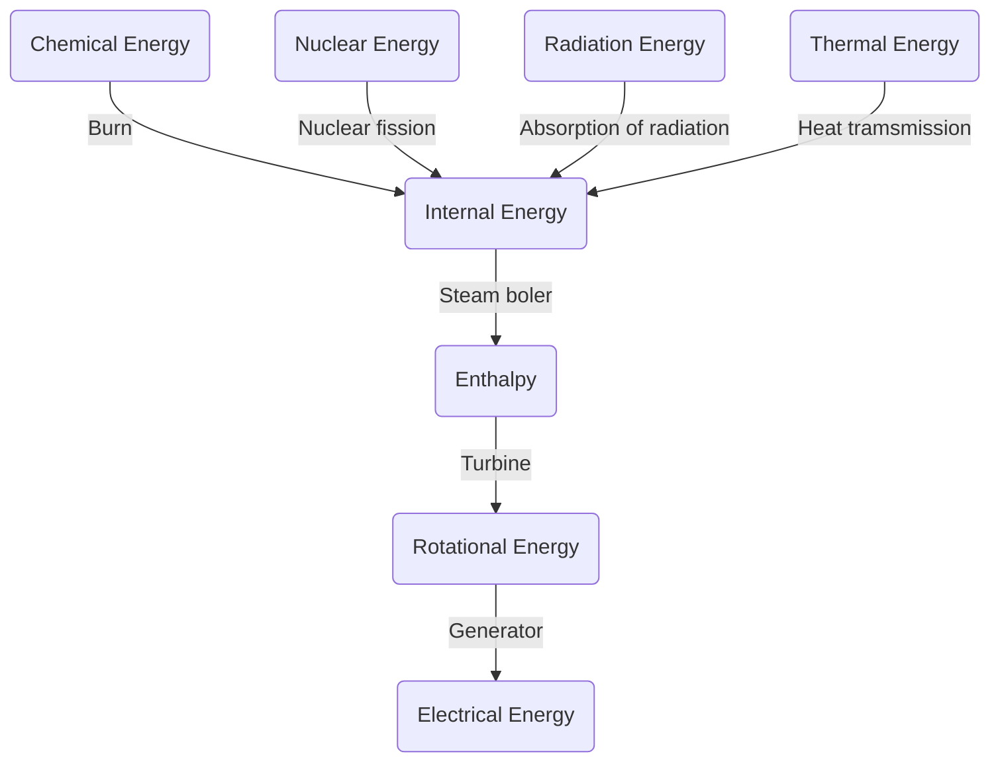

#### Electrical Power Output

$P_{el, gross}$ - gross power in $W$ delivered at the generator terminal

$P_{el,net}$ - power delivered at the high-voltage side of the machine transformer (less the power requirements of all emergency and auxiliary equipment)

#### Electrical Auxiliary Power

$P_{EB} = P_{el, gross} - P_{el,net}$ 

Unit efficiency: [See above](#unit-efficiency)

### Mechanical Power Plant

#### Basic Principle

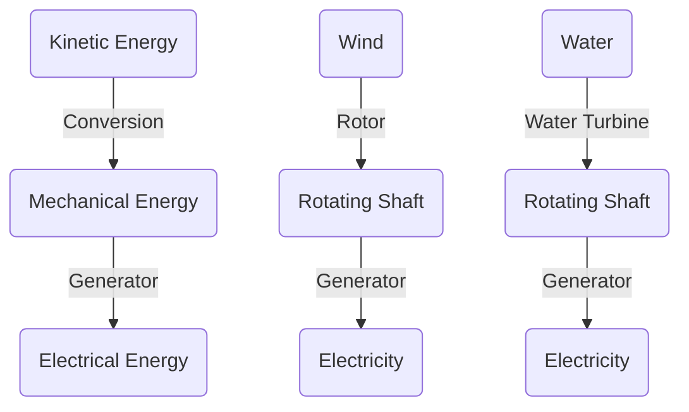

### Direct Electricity Generation

#### Basic Principle

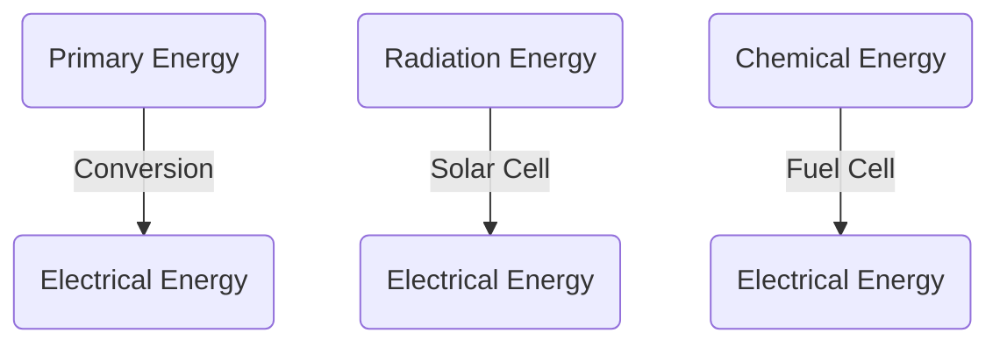

## Fundamentals of Electrical Engineering

### Electric Charge

$$
Q = \sum_{i=1}^N q_i
$$

where

$N\ i \in \mathbb{N}$

$q_i = e = 1.6 \cdot 10^{-19}\ C$ - elementary charge of an electron in Couloumb

### Electric Current

$$
\frac{\Delta Q}{\Delta t} = I
$$

unit - Ampère $[A]$

#### Flow Direction

- technical: $+ \implies -$
- physical: $- \implies +$

### Voltage, Resistance, Current

#### Voltage

$$
U_{12} = \phi_1 - \phi_2 = \frac{dW}{dQ}
$$

where

$\phi = \frac{W}{Q}$ - electric potential

$W$ - energy required to move a charge from $1$ to $2$ in Watt Second $Ws$

unit - Volt $V$

#### Resistance

$$
R = \frac{U}{I}
$$

unit - Ohm $\Omega$

#### Power

$$
P = I \cdot I
$$

unit - Watt $W$

### Capacitance and Inductance

#### Capacitor

A capacitor stores electric energy in an electric field.

Capacitance - How much charge can be stored for a given
voltage.

$$
C = \frac{Q}{U}
$$

$$
I_c = C \cdot \frac{dU_c}{dt}
$$

#### Inductor

An inductor stores electric energy in a magnetic field.

Inductance - How much magnetic flux $\Psi$ can be generated for a given current.

$$
L = \frac{\Psi}{I}
$$

$$
U_L = L \cdot \frac{dI_L}{dt}
$$

#### Types of Circuits

##### Series

- _current_ same for all elements
- resistance additive
- inductance additive
- capacitance additive (reciprocal)

##### Parallel
- _voltage_ same for all elements
- resistance additive (reciprocal)
- inductance additive (reciprocal)
- capacitance additive

### Electric and Magnetic Fields

Magnetic and electric fields are coupled by the Maxwell
equations. When changing over time, they can generate
each other → eddy-currents, electromagnetic waves...

### Electric Field

A model to describe the local force exerted on an electric charge: $\vec{F} = q \cdot \vec{E}$.

- A tensor field
- Electric fields arise through charges (and changing magnetic fields)
- Charges are sources and sinks of the electric field
- n the static case: E-field is free of curls and can be described by a potential

### Magnetic Field

A model to describe the local force exerted on a current

- A tensor field
- Magnetic fields arise through moving charges, i.e. currents
- Curl-field, without sinks or sources

### Lorentz Force

Force on a charge travelling in a magnetic field

$$
\vec{F} = Q \cdot (\vec{v} \times \vec{B})
$$

where

$Q$ - charge

$\vec{v}$ - velocity 

$\vec{B}$ - magnetic flux density

- If the charge moves perpendicularly or obliquely to the magnetic field, the Lorentz force acts on the charge and distracts its path.
- Also applicable to conductors that carry the charges.

### Electricity Generation

Conversion from mechanical energy via induction:

- Changing the magnetic flux through a conductive loop induces a voltage.
- Can be built into big generators with three _loops_.
- A rotating magnetic field (e.g. from a magnet) induces a sinusoidal voltage in each of the loops.
- If the loops are evenly spaced (120°) we get _3-phase AC power_.

### Alternating Current (AC)

#### Voltage

$$
u(t) = \^u \cdot cos(\omega \cdot t + \phi_u)
$$

#### Current

$$
i(t) = \^i \cdot cos (\omega \cdot t + \phi_i)
$$

#### Power

$$
p(t) = u(t) \cdot i(t)
$$

where

$\^u, \^i$ - amplitudes

$\omega = 2\pi \cdot f$ - angular frequency

$\phi_u, \phi_i$ - zero phase angles

$\phi = \phi_u - \phi_i$ - phase angle between current and voltage

$$
\implies phasor:\quad u(t) = \^{u}e^{i\omega t + \phi_0}, j = \sqrt{-1}
$$

#### Stationary Phasors

All phasors in a linear circuit rotate with the same $\omega t$, hence $\omega t$ can be omitted:

Voltage:

$$
\vec{u} = \^u \cdot e^{j\phi_u}
$$

Current:

$$
\vec{i} = \^u \cdot e^{j\phi_i}
$$

One observes quasi-stationary behaviour: If amplitudes and relative phase angles are constant, the time dependency disappears.

#### Complex Resistance & Ohm's Law

$$
Z = R + jX = R + j\left(\omega \cdot L - \frac{1}{\omega \cdot C}\right)
$$

where

$\vec Z$ - Impedence

$R$ - Resistance

$X$ - Reactance

Ohm's Law for phasors:

$$
\vec u = \vec Z \cdot \vec i
$$

#### Phase Shift for Resistance

For ohmic resistors, current and voltage run in phase.

$$
u(t) = R \cdot i(t)
$$

#### Phase Shift for Inductors

- The current follows the voltage with 90 degrees of phase shift.
- The Reactance increases with frequency.

$$
u(t) = L \frac{di(t)}{dt}
$$

#### Phase Shift for Capacitors

- The voltage follows the current with 90 degrees of phase shift.
- The impedance decreases with frequency.

$$
u(t) = \frac{1}{C} \int i(t)dt
$$

#### Conductance, Susceptance and Admittance

Admittance $\vec Y$: the inverse of impedence.

$$
\vec Y = G +jB
$$

Conductance

$$
G = \frac{1}{R}
$$

Susceptance

$$
B = \frac{1}{X}
$$

#### RMS Value

The Root Mean Square (RMS) RMS-value helps to quantify the power of a signal, independent of its _shape_.

It gives one the amplitude of an equivalent constant (DC)-signal that would dissipate the same power when applied to resistor.

For distorted signals the RMS values are well-defined,
peak values ($\^s$) are not. → RMS values are the norm.

$$
s_{rms, sine} = \frac{\^s}{\sqrt{2}} \approx \^s \cdot 0.707
$$

### 3-phase System 

#### Wye (Y)-connection

- Superposition of 3 sinusoids, shifted by 120 degrees generates a constant torque vector in induction machines.
- The sum of the powers has low ripple.
- 3 phase wires (colors: black, gray, brown)
- neutral conductor (color: blue)
- sometimes, protective earth (color: yellow-green) in TN-CS and TN-S connected installations
  
Voltage relation

$$
U_{L1, L2} = \sqrt{3} \cdot U_{L1, N}
$$

#### Delta-connection

- Used in the transmission, HV and MV distribution grids
- Conductors:
  - 3 phases
  - earth wire - sometimes
- Saves the cost for the neutral wire
- Requires decent symmetry of the phase loads
  
### Complex Power

Instantaneous power in AC-systems equals the DC definition: $p(t) = u(t) \cdot i(t)$. However, ideal inductors and capacitors do not dissipate energy but still _draw_ current. So, a different interpretation is needed:

#### Active Power in Watt $[W]$

$$
P = \int_T p(t) dt
$$

#### Apparent Power in Volt-Ampère $[VA]$

$$
S = U_{eff} \cdot I_{eff} = |P + jQ|
$$

#### Reactive Power in Volt-Ampère reactive $[var]$

$$
Q = S \cdot cos(\phi_{u,i})
$$

### Types of Currents

#### AC

Pros:
- easy voltage conversion
- high voltages for low ohmic losses possible ($P_{loss} \propto i^2$)
- easy current interruption
- mature technology (efficient generators)

Cons:
- for large conductors: eddy current losses
- for high voltages: higher corona discharge losses compared to equivalent DC-line
- for HV-cables and very long overhead lines: Lines require impedance compensation
- more complex analysis

_AC is very flexible, proven to work, but has weaknesses in HV and long distance Transmission._

#### DC

Pros:
- small losses for HV and large distances
- higher voltages on same transmission line (less material)
- fully controllable power flow of a HV-DC-Link
- simpler analysis
- many electric devices use DC internally, PV produces DC

Cons:
- very high cost for converter stations in HV
- current interruption problem
- no meshed networks
- higher losses for MV, LV and short distances

_DC allows efficient high-voltage point-to-point transmission and power flow control._

### Power Grid Modelling

Assumption: Symmetry between the three phases

#### Kirchhoff Current Law

The sum of all currents at a node equals zero

$$
\sum_I I_i = 0
$$

#### Kirchhoff Voltage Law

The sum of all voltages in a loop equals
zero

$$
\sum_I U_i = 0
$$

#### Graph Modelling

- busses become nodes
- edges connect nodes
- generators insert power
- loads extract power

### Technical Components

#### Electricl Machines

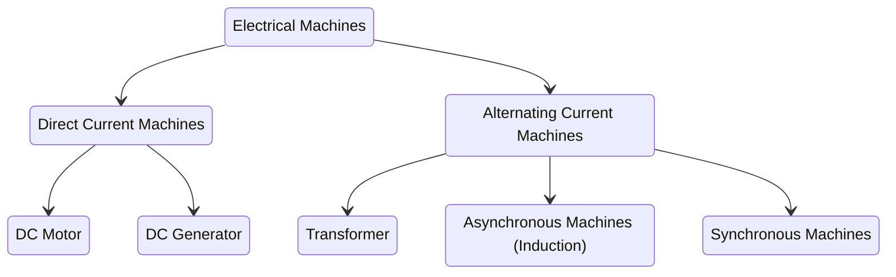

#### Transformer

Transformers isolate two circuits in the sense of a floating voltage source.

Working principle:
- The alternating voltage in the primary coil induces an alternating current in the primary coil.
- The AC causes a constantly changing magnetic field (in the iron core and) in the second coil.
- The changing magnetic field induces a voltage in the secondary coil.
- The frequency in both coils is identical.

##### Ideal Transformer Model

Voltages:

$$
\frac{U_1}{U_2} = \frac{N_1}{N_2} = r
$$

Currents:

$$
\frac{I_1}{I_2} = \frac{N_2}{N_1} = \frac{1}{r}
$$

$$
\implies U1 \cdot I_1 = U_2 \cdot I_2
$$

##### Real Transformer Model

A real transformer differs from an ideal transformer in:
- Winding resistances $R_p$, $R_s$ on primary and secondary side
- Leakage flux that does not reach the "other" side.
- Parasitic capacitance that further limit the bandwidth.
- Losses due to magnetic construction.
- Efficiencies between 98% - 99%.
  
#### Generator

A generator transforms kinetic and potential energy (e.g. wind, water) and chemical energy (e.g. gas, coal) via rotation into electrical energy.

In the generator a magnet rotates and induces a magnetic field by passing coils every 120° creating a sine wave for each coil. This yields 3-phase AC power.

##### Frequency

$$
50\ Hz = 3000\ RPM
$$

- 50 $Hz$ used in Europe, Asia, East Japan
- 60 $Hz$ used in America (mostly), West Japan
  
###### Effects of Frequency Choice

Lower:
- reduced losses in rotating machines - higher
efficiency and reliability
- reduced eddy current losses
- lower impedance of overhead transmission lines less compensation needed for long distances

Higher:
- less visible flickering of lamps
- smaller and lighter magnetic components → aviation industry uses 400 Hz

#### Electric Drive

An electric drive is an _inverted_ generator:
- transforms AC power to rotational energy
- the AC power induces a changing electromagnetic field in the stator (coil), which lets the magnet in the rotor spin
- DC drives repeatedly change the direction of power to imitate AC power

#### Electric Vehicles (EVs)

An electric vehicle contains a battery, an electric drive, and converters

- DC batteries (400 $V$ - 800 $V$)
- Converters convert electricity from the battery into AC for
  - electric devices @ 12 $V$
  - power steering @ 42 $V$
  
Higher battery voltages:
- lead to less power losses, faster charging and better driving performance, less material use, less cooling, and, hence, less costs.
- emit higher electromagnetic interference and stronger magnetic fields impacting other electric devices.

## Solar Thermal and Solar Power Plants

### Power Electronics

Power Electronics deals with the control and conversion of electric power by the use of electronic switches.

#### Converter

Types:
- AC/AC converter: Changes frequency
- DC/DC converter: Changes voltage
- Inverter
  - Using a transistor circuit, repeatedly opening and closing two gates can be used to create a sinusoidal form.
  - The form is filtered and smoothed with a coil and a capacitor.
  - Efficiency: $\eta \le 98\%$
- Rectifier
  - Consists of switching or non-linear elements that conduct in only one direction (diodes)
  - The output can be smoothed (via a RLC filter) to provide a nearly constant voltage, however the level is dictated by the AC input.
  
### Solar Radiation

#### Composition of the sun
- 80% hydrogen
- 20% helium
- 0.1% other elements

#### Nuclear fusion

Fusion of four hydrogen nuclei into one helium nucleus + energy

Luminosity (radiation power) of the sun: 

$$
\phi_{e, S} = 3.8 \times 10^{26}\ W
$$

Specific radiation of the sun:

$$
M_{e,S} = \frac{\phi_{e, S}}{A_{sun}} = 63.3\ MW/m^2
$$

$$
\implies Radiation\ of\ 0.25\ km^2\ of\ the\ Sun = Annual\ primary\ energy\ demand\ of\ Earth
$$

Solar constant: $G_0 = (1360.8 \pm 0.5)\ W/m^2$
- (-) reflection (atmosphere)
- (-) absorption ($O_3, H_2 O, CO_2$)
- (-) Rayleigh scattering (small molecular components)
- (-) Mie scattering (dust particles)
  
Global radiation intensity (on horizontal surface) as the sum of direct and diffuse radiation intensity:

$$
G_{hor, g} = G_{hor, dir} + G_{hor, diff}
$$

### Solar Thermal Power Plants

_CSP = Concentrated Solar Power_

- Bundle/concentrate sunlight and generate electrical energy through a thermodynamic cycle process
- Often combined with thermal storage (to balance nightly/daily fluctuation of the sun)

#### Concentration factor

$$
C = \frac{A_C}{A_R}
$$

where

$A_C$ - surface of concentrator

$A_R$ - surface of receiver

Types of concentrators
- line
  - Parabolic troughs, Fresnel collector
- point
    - Parabolic mirrors, solar towers
  
#### Collector net power

$$
\.Q_{CN} = G_{C,dir} \cdot A_C \cdot \eta_{opt} - \.Q_L
$$

where

$\.Q_{CN}$ - collector net power in $W$

$G_{C,dir}$ - direct radiation intensity on collector in $W/m^2$

$A_C$ - surface of collector in $m^2$

$\eta_{opt}$ - optical efficiency

$\.Q_L$ - collector thermal losses in $W$

Factors influencing efficiency:
- cleanliness
- angle of incidence
- reflectance, transmittance
- absorptance, degree of dispersion

#### Collector efficiency $\eta_C = \frac{collector\ net\ power}{global\ radiation\ power }$

$$
\eta_C = \frac{\.Q{CN}}{G_{C, dir} \cdot A_C} = \eta_{opt} - \frac{\.Q_L}{G_{C, dir} \cdot A_C}
$$

- $\uarr$ radiation concentration $\implies$ $\uarr$ absorber temperature
- $\uarr$ radiation concentration $\implies$ $\darr$ heat losses

Objective: **high radiation concentration**

_Concentration factor of over 100 only through biaxial point concentrators_

### Photovoltaics

#### External photoelectric effect

Extraction of electrons from a semiconductor or metal surface through radiation with short-waved light

#### Solar Cell

##### P-doping
- Adding atoms with five valence electrons into a silicon (Si) lattice → e.g. phosphorus (P), antimony (Sb)
- Surplus of negative charge carriers → N-doping

##### N-doping
- Adding atoms with three valence electrons into a silicon (Si) lattice → e.g. boron (B), aluminium (Al)
- Surplus of positive charge carriers → P-doping
  
##### pn-junction

- Free electrons from n-zone diffuse into the p-zone → Leaving behind positively charged ions
- Free holes from p-zone diffuse into the n-zone → Leaving behind negatively charged ions
- Transition zone between p- and n-zone with reverse charge distribution (i.e. _diffusion buffer_)

##### Photon hits

Possible reactions:
- reflection
- transmission
- recombination
- charge separation

##### Efficiency $\eta = \frac{Benefit}{Input}$

$$
\eta = \frac{P_{el}}{P_{radiation}} = \frac{P_{MPP}}{G \cdot A}
$$

where

$P_{el}$ - electrical power

$P_{radiation}$ - radiation power

$P_{MPP}$ - Maximum Power Point in $W_p$

$G$ - radiation intensity in $W/m^2$

$A$ - surface of solar cell in $m^2$

##### Production

- Silicon
- Quartz sand ($SiO_2$) as raw material
- Energetic amortization ot mono-Si: 1.7 - 2.7 years

## Wind Power and Hydroelectric Power Plants

### Wind

#### Global
- lower solar radiation at the poles; higher solar radiation near the equator
  - circulation cells
- earth rotation 
  - trade winds
- currents from high to low pressure areas
- Coriolis force (deflects accelerated air mass)
  
#### Local
- unequal warming of regions
  - winds with smaller spacial and temporal range
- based on geographical features and daily/seasonal changes in temperature

#### Wind velocity distribution
- average wind velocity
  - insufficient metric, since no statement on duration of calm or consistency of wind velocity
- relative frequency distribution
  - how often does a certain wind velocity occur
- Weibull dist.
- Rayleigh dist.

#### Influence of environment and height

- Objects, plants, uneven terrain strongly reduce the wind velocity
- With increasing height the wind velocity increases
- The rougher the terrain, the more the wind velocity increases with the height

### Wind Power Plants

#### Energy and Power of the wind

$$
E_{kin} = \frac{1}{2} \cdot m \cdot v_w^2
$$

Maximum usable power (**3. Power Law**)

$$
P_0 = \frac{1}{2} \cdot A \cdot \rho \cdot v_w^3
$$

where

$m$ - air mass in $kg$

$A$ - streamed-through area

$\rho$ - air density in $kg/m^3$

$v_w$ - wind velocity in $m/s$

Utilization of wind energy possible at wind velocities between 3 - 25 $m/s$.

#### Power drain in a wind turbine

$$
P_N = \frac{1}{4} \cdot \rho \cdot A \cdot (v_1 + v_2) \cdot (v_1^2 - v_2^2)
$$

Power coefficient: $c_p = \frac{Used\ wind\ power}{Incoming\ wind\ power} = \frac{P_N}{P_0}$

Ideal velocity ratio: $v_2 = \frac{1}{3} \cdot v_1$

**Betz's Law** (theoretically usable max. power): $c_{p, Betz} = \frac{16}{27} \approx 60\%$.

#### Classification

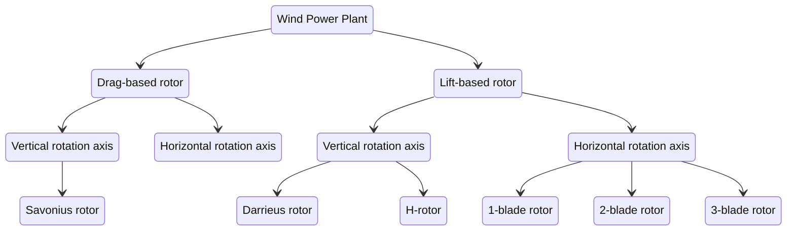

#### Tip speed ratio

$$
\lambda = \frac{u}{v_w}
$$

where

$u$ - circumferential speed of the rotor blade tip in $m/s$

$v_w$ - wind velocity in $m/s$

Slow runner:
- historic wind wheels
- drag-based rotor
- Savounius rotor

Fast runner:
- Darrieus rotor
- lift-based rotor

#### Velocity classification

- Switching on velocity: 2 - 3 $m/s$
- Normal wind velocity: 10 - 15 $m/s$
- Shutdown velocity: 20 - 25 $m/s$

**NB!:** Double rotor diameter means **quadruple** power

**NB!:** (**3. Power Law**) Double wind speed means **eightfold** power

$\implies$ wind power plants are getting bigger and higher

#### Power control

- Pitch control (active)
- Stall control (passive)
- Azimuth control (active)
  
#### Generator system

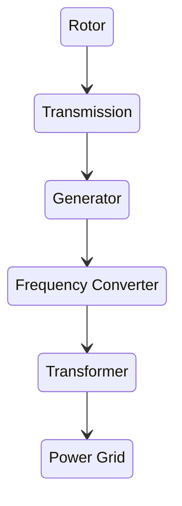
- Frequency Converter - converts the variable frequency of the generator into the fixed frequency of the grid
- Transformer - Converts the resulting voltage of the generator to the voltage needed for the grid and provides galvanic isolation of the two systems

#### Wind energy in Germany

- ca. 9% of total electricity generation (2014)
- ca. 25% of total electricity generation (2022)

- Conditions for installing new capacity (wind velocity and potential full load hours) best in the NW, on the coasts.

### Hydroelectric Power Plants

#### HPP in Germany

- 20% share in electricity generation from renewable energies
- greatest potential southern states (pre-alpine region)
- modernization and reactivation of available plants (power increase)

#### Water Law

- Sufficient minimum water flow
- Maintenance of river continuity
- Appropriate measures to protect the fish population

#### Types of HPP

- Run-of-river power plant
- Storage power plant
- Pumped-storage power plant
- Special types
  - Tidal power plant
  - Marine current power plant
  - Wave power plant

##### Storable amount of energy

$$
E = V \cdot \rho \cdot g \cdot h_P \cdot \eta_{RTG}
$$

##### Power Capacity - $P$

$$
\.E = P = Q \cdot \rho \cdot g \cdot h_P \cdot \eta_{RTG}
$$

where

$V$ - storage volume in $m^3$

$\rho \approx 1000 kg/m^3$ - density of water

$g = 9.81 m/s^2$ - gravitational constant

$h_P$ - average height drop in $m$

$\eta_{RTG}$ - efficiency of pipelines, turbines and generators in reconversion

#### Water Turbines

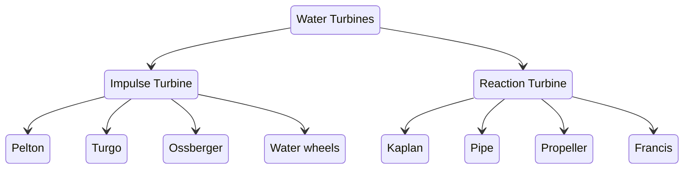

- Impulse Turbine
  - No pressure difference between above and
below the impeller => uses kinetic energy of water
  - Use in storage power plants
- Reaction Turbine
  - Higher pressure above than below the impeller => uses pressure
  - Use in run-of-river power stations; pumped storage (Francis)

## Utilization of Biomass, Geothermal Energy

### Biomass

#### Macro

- phytomass and zoomass living in nature (plants and animals)
- residues byproducts and waste products
- dead phytomass and zoomass
- others

#### Cellular

- cellulose - $C_6H_{10}O_5$
- lignin
- hemicellulose

#### Generation via photosynthesis

$$
H_2O + CO_2 + Auxiliary\ Materials + \Delta E \rarr C_kH_mO_n + H_2O + O_2 + Metabolic\ Products
$$

$Auxiliary\ Products$ - chlorophylls, phycobiline, carotenoids, bacteriorhodopsin

#### Utilization

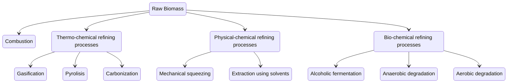
- Gasification
  - biogenic solid fuels to flammable gases
  - at high temperatures
  - further conversion to liquid fuel possible
- Pyrolisis
  - biogenic solid fuels to liquid components
  - at high temperatures
  - anaerobic
- Carbonization
  - biogenic solid fuels into refined solid fuels
  - through thermal decomposition
  - anaerobic
- Physical-chemical refining processes
  - plant oil-based bioenergy carriers
  - mechanical squeezing or extraction using solvents
- Alcoholic fermentation
  - organic mass in an aqueous environment to bioethanol
  - alcoholic fermentation by yeast bacteria
- Anaerobic degradation
  - organic matter to biogas
  - 2/3 methane
- Aerobic degradation
  - oxidation of biomass to carbon dioxide (composting)
  - releases heat
  - powers heat pumps
  
#### Bioenergy carriers

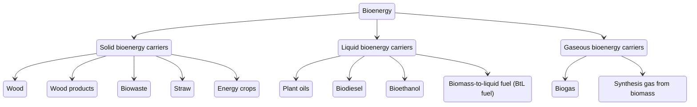

#### Biomass in Germany

- 55% of total renewable energy (2021)
- 21.6% of renewable energy for electricity generation (2021)

### Geothermal

#### Source

- radioactive decay of
  - $U^{235}$, $U^{238}$ and $K^{40}$
- 99% of the earth is hotter than 1000°C
- ca. 90% of the earth's crust are hotter than 100°C
- at depths between 0 and 1 km temperatures are usually far below 100°C

#### Temperature gradient

- 35-40K per km of depth
- heat anomalies exist
  - potential for electricity generation
- low heat flow density from the earth's interior
- need to prevent rapid cooling of respective earth body

#### Geothermal Sources

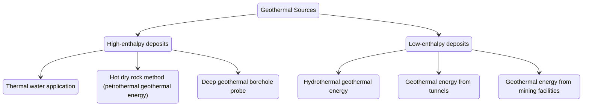

##### High enthalpy
  
- vulcanic areas - utilization of heat anomalies
  - industrial-use steam
  - electricity generation
  - local and district heating
- may or may not naturally contain thermal water
- high pressures
  - has to be maintained
  - pump water (back)
- high temperatures (several hundred °C)
- hot dry rock (petrothermal) method
  - _injection well_
  - _conveyor_ or _production well_

###### Deep geothermal borehole probe
  - closed system - prevents mineral contamination
  - 2-3 km deep well
  - coaxial tube
    - annulus - cold medium flows downwards
    - riser - reheated medium flows upwards
  - pros
    - no contant with ground water
  - cons
    - lower power compared to open systems - less area for heat exchange
  
##### Low enthalpy

- in non-vulcanic areas
- use fluids - hot water aquifers
- water flows between _injection_ and _delivery well_ naturally
- temperatures in range 80-160 °C
  - 100 °C lower economic boundary
- pros
  - widespread
  - usable for hear and electricity generation
- cons
  - drilling expensive
  - geological risks
  - mineral precipitation - resolidification

#### Geothermal heating plants

- temperatures below 100 °C sufficient
- depths of ca. 2 km in Germany
- feed pump brings hot water to the surface
- water highly salty and carrying radioactive materials - use a heat exchanger
- medium pumped into local or district heating network

#### Geothermal electricity generation

- direct use of steam
  - steam strongly corrosive
- flash power plants
  - partial expansion of hot, pressurized deep thermal water
  - steam drives turbine
- Organic Rankine Cycles (ORC-) power plants
  - usable below 80 °C
  - medium with lower evaporation temperature - isopentane PF5050 (30 °C)
- Kalina power plants
  - mix of water and ammoniac
  - better thermodynamic process characteristics

#### Efficiency

- heating plant - ca. 54%
- electricity generation - 6%
- cogeneration 
  - useful heat - 12%
  - electricity - 6%

#### Geothermal energy in Germany
- ca. 4% of renewables in total energy mix (2021)
- 0% of renewable electricity mix (2021)
- ca. 9,8% of renewable heating mix (2021)

### Energy Storage

#### Residual load

Load that has to be covered by conventional power plants after deduction of the feed-in from renewable energies and heat-controlled CHP-plants.

$$
P_{Residual\ load} = P_{Total\ load} - P_{Renewables + heat-controlled\ CHP}
$$

- positive residual load
  - intermittent renewable feed-in cannot cover the current load
- negative residual load
  - intermittent renewable supply greater than current load

German residual load exhibits a decreasing tendency - need for storage

#### How to balance energy generation and consumption

- generation and load management
- transport
- storage

#### Thermal storage

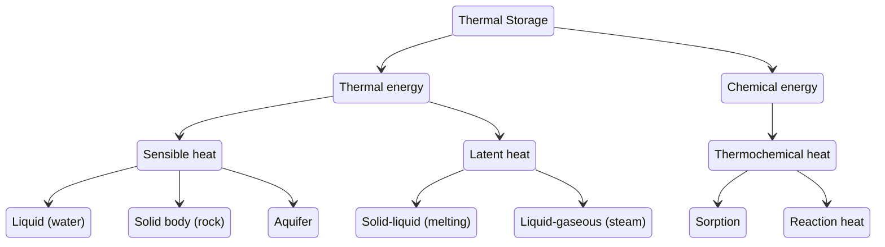

#### Sensible heat storage system

Recall [heat](#heat).

- water tank
  - central water storage
  - seasonal water storage

#### Latent heat storage

- utilization of enthalpy during melting and vaporization of a storage material
- latent heat added during melting and released during freezing

Phase transitions:

| src $\darr$ dst $\rarr$ | solid      | liquid       | gaseous       |
|---------------------------|------------|--------------|---------------|
| **solid**                 |            | melting      | sublimination |
| **liquid**                | freezing   |              | vaporization  |
| **gaseous**               | deposition | condensation |               |

#### Enthalpy of melting

Temperature does not change during the melting when heat is added

##### Heat of melting

$$
Q = m \cdot \lambda_S
$$

where

$m$ - mass in $kg$

$\lambda_S$ - specific heat of fusion in $kJ/kg$

#### Enthalpy of vaporization

During vaporization, the temperature does not change when adding heat

##### Heat of vaporization

$$
Q = m \cdot \lambda_D
$$

where

$m$ - mass in $kg$

$\lambda_D$ - specific heat of vaporization in $kJ/kg$

#### Phase change materials (PCM)

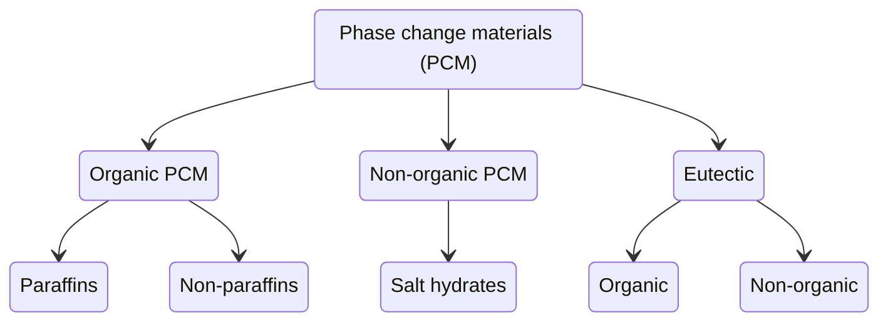

Eutectic: Combination of substances with a certain mixing ratio at which the melting point of the eutectic mixture is lower than that of the pure substances; Salt mixtures.

#### Thermochemical heat storage system

##### Sorption heat storage system

- Desorption
  - stores desorption heat
  - gives off condensation heat
- Adsorption
  - stores vaporization heat
  - gives off adsorption heat

##### Reaction heat storage

Basic principle: reversible gas-solid reaction

$$
A+B \rightleftharpoons AB + Heat
$$

##### Power-to-Heat

- heating rod
- heat pump

Power-to-Heat-to-Power: Thermo-potential storage

##### Carnot battery

Power-to-Heat-to-Power storage

- high-temperature heat pump
  - water - 50 °C
  - liquid salt - 500 °C
- on demand conversion via a heat engine
- total efficiency - ca. 60%

#### Mechanical storage

- potential energy
  - pumped-storage power plants
    - could cover average German el. load for ~34 min
  - compressed air storage
- kinetic/rotational energy
  - flywheel energy storage
  
##### Compressed air storage

Work

$$
W = \int_{V_1}^{V_2} p\ dV
$$

where

$W$ - work in $J$

$V$ - volume in $m^3$

$P$ - pressure in $bar$

Recall [state of ideal gas](#state-of-ideal-gas).

Classification:

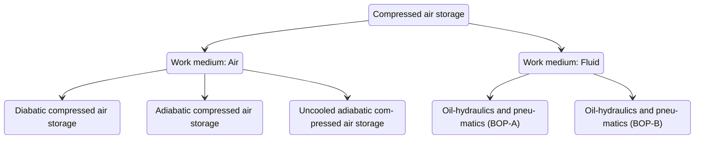

##### Flywheel energy storage

Kinetic energy of a rotating body:

$$
E_{kin} = \frac{1}{2} \cdot J \cdot \omega^2
$$

where

$J$ - moment of inertia in $kg\ m^3$

$\omega$ - angular velocity in $U/min$

Efficiency - 90-95%
Discharge rate - up to 20% in 1 h

#### Electrodynamic storage

##### Capacitors

- a capacitor consists of two conductors separated by a non-conductive region
- storage of electrical energy in an electrical field
- a capacitor has the capacitance of 1 $F$ (farad) when charged with a current of $1A$ in $1\ s$ up to $1V$.
  
$$
1F = 1\ As/V
$$

Maximum capacity:

$$
E_{capacitor} = \frac{1}{2} \cdot C \cdot U^2
$$

where

$C$ - capacitance in Farad $[F]$

$U$ - voltage in $V$

Taxonomy:

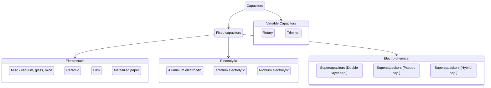

